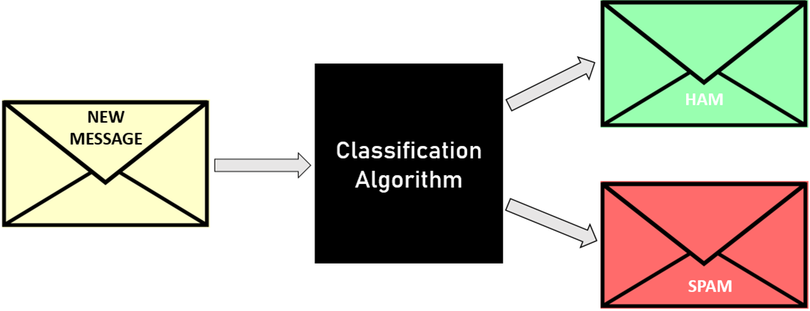

# **Spam Email Classification**

# *Introduction*
In today's digital world, spam emails are a constant nuisance. They clog inboxes, waste time, and can even pose security threats containing phishing attempts or malware. This document details the development of a machine learning model designed to tackle this problem by automatically classifying incoming emails as spam or legitimate (ham).
# *Data Cleaning*
- **Data Description**
Our data set is 5 columns. The first column is the index of the email, the second column is “# sent email” which describes the number of times this email has been sent, the third column “label” describes the email as ham and spam, the fourth column is “text” describes email content, the final column describe the third column as 0’s and 1’s.
- **Data Cleaning**
First step we check null values and duplication which is 0 and renaming “label_num” to be “IS_Spam” to be more readable because this is the target column.
# *Data Exploring*
- **Histogram**
   

- **Pie Chart**

.png>)

- **Word cloud for Spam emails**

.png>)

- **Word cloud for ham emails**

.png>)

- **Top 30 words in Spam Emails**

.png>)

- **Top 30 words in ham emails**

 .png>)

# *Data Modeling*
Using TF IDF in the “text” column we generate their models
- **Naïve Bayes**

Accuracy of training = 0.9400386

Precision of training = 0.94599

Recall of training = 0.84245

Accuracy of testing = 0.9333

Precision of testing = 0.95599

Recall of testing = 0.80245

Confusion Matrix:

.png>)

- **Logistic Regression**

Accuracy of training = 0.9700

Precision of training = 0.9307

Recall of training = 0.96932

Accuracy of testing = 0.96908

Precision of testing = 0.93939

Recall of testing = 0.9522

Confusion Matrix:

.png>)

- **SVM**

Accuracy of training = 0.97340

Precision of training = 0.92349

Recall of training = 0.9908

Accuracy of testing = 0.97294

Precision of testing = 0.91536

Recall of testing = 0.9965

Confusion Matrix:

.png>)

- **Decision Tree**

Accuracy of training = 0.99854

Precision of training = 0.9950

Recall of training = 1.0

Accuracy of testing = 0.956

Precision of testing = 0.9078

Recall of testing = 0.9419

Confusion Matrix:

.png>)

- **KNN**

Accuracy of training = 0.9514

Precision of training = 0.9122

Recall of training = 0.92205

Accuracy of testing = 0.9062

Precision of testing = 0.8379

Recall of testing = 0.8293

Confusion Matrix:

.png>)